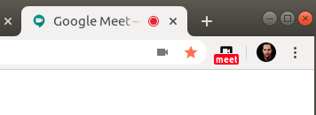
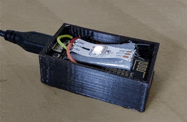

OnAir Signal with Chrome Extension
==================================

This ESP8266 based led shows a red blinking light whenever you have a running Google Meet session.
Put it above your home-office door or next to your working place to signal your family or flatmates that you're in a call right now.

### Chrome Extension

It even detects if you mute yourself or turn off your camera.

### Hardware Setup

* ESP8266 
* WS21812B on Pin D1

### How to use:

0. Change Wifi SSID and Password 
1. Flash your ESP8266
2. Change the ESP's IP Address in background.js
3. Load unpacked Extension (https://developer.chrome.com/extensions/getstarted#manifest)

